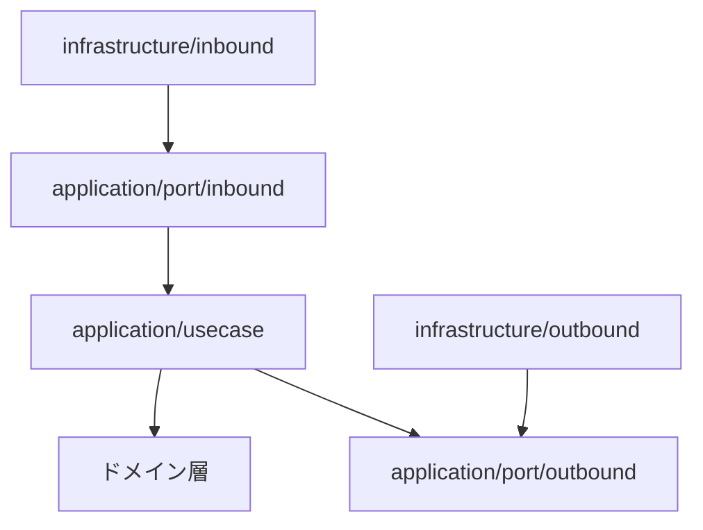
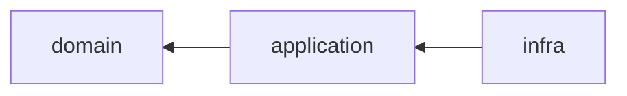

# アーキテクチャ概要

## システムアーキテクチャ
- 書籍管理という限定的な要件のため、モノリシックアーキテクチャを採用する
- ローカル環境 
  - アプリケーションと PostgreSQL は 個別コンテナとして実行する 
  - Docker Compose はローカル環境を構築するための任意の手段とする。アプリケーションは Docker に依存せず、設定された DB・外部サービスへ接続する

## ソフトウェアアーキテクチャ
- Clean Architecture を採用
    - `application/port/inbound`: ユースケースを呼び出す契約
    - `application/usecase`: ユースケース実装
    - `application/port/outbound`: 永続化・外部連携の契約
    - `domain`: エンティティと値オブジェクト
    - `infrastructure/inbound`: REST・SQS などの入力アダプタ
    - `infrastructure/outbound`: jOOQ などの出力アダプタ

### レイヤーごとの責務
- inbound: REST/SQS のリクエスト変換、入力検証、入力ポートの呼び出しに限定する。
- inbound port: inbound アダプタが利用するユースケースの契約を定義する。
- usecase: ワークフロー調整とアプリケーションサービスを担い、port を通じて外部要素を利用する。
- outbound port: ユースケースが必要とする永続化・検索の契約と参照モデルを定義する。
- domain: エンティティ、値オブジェクト、不変条件を保持する。フレームワークや永続化に依存しない。
- outbound: RDB などの外部リソースを実装し、outbound port を満たす。
- application 層の Spring 依存を許容し、ユースケース・サービスは `@Service` で登録する。更新系ユースケースは入力ポートを直接実装し、`@Transactional` でトランザクション境界を宣言する。domain 層は Spring に依存しない。
- 外部ライブラリのクライアントなど、生成時に設定が必要な Bean は `infrastructure/config` 等の `@Bean` で組み立てる。

### Gradle モジュール

各層は次の Gradle サブプロジェクトに対応する。依存は内側の層にだけ向け、逆方向の依存を作らない。

- `domain`: ドメインモデル
- `application`: ユースケースとポート
- `infra`: 実行可能な Spring Boot アプリケーションと各種アダプタ

### 設計の進め方
- ドメインモデルは [`domain-modeling.drawio.svg`](./domain-modeling.drawio.svg) を基準とする
- ドメイン層は戦術的 DDD パターン（値オブジェクト / エンティティ）で実装する

## API 設計の前提
- REST 原則に従う（リソース指向、HTTP メソッドの意味付け）
- HATEOAS は必須ではない
- URI パターン・命名・レスポンス形式は既存 API と整合させる

### API とバッチの起動分離

同じ `infra` モジュールで、API は `BookManagerApplication`、バッチは
`bootstrap/batch/BatchApplication` を起動します。
API は `application`・`inbound/rest`・`inbound/messaging`・`config`・`outbound` をスキャンします。
バッチは `application`・`inbound/job`・`config`・`outbound` をスキャンします。
バッチ専用の入力処理はバッチ起動クラスのコンポーネントスキャンにだけ含めます。
バッチは Web を無効化し、Runner が保持する終了コードを main 関数でプロセスの終了コードに変換します。
