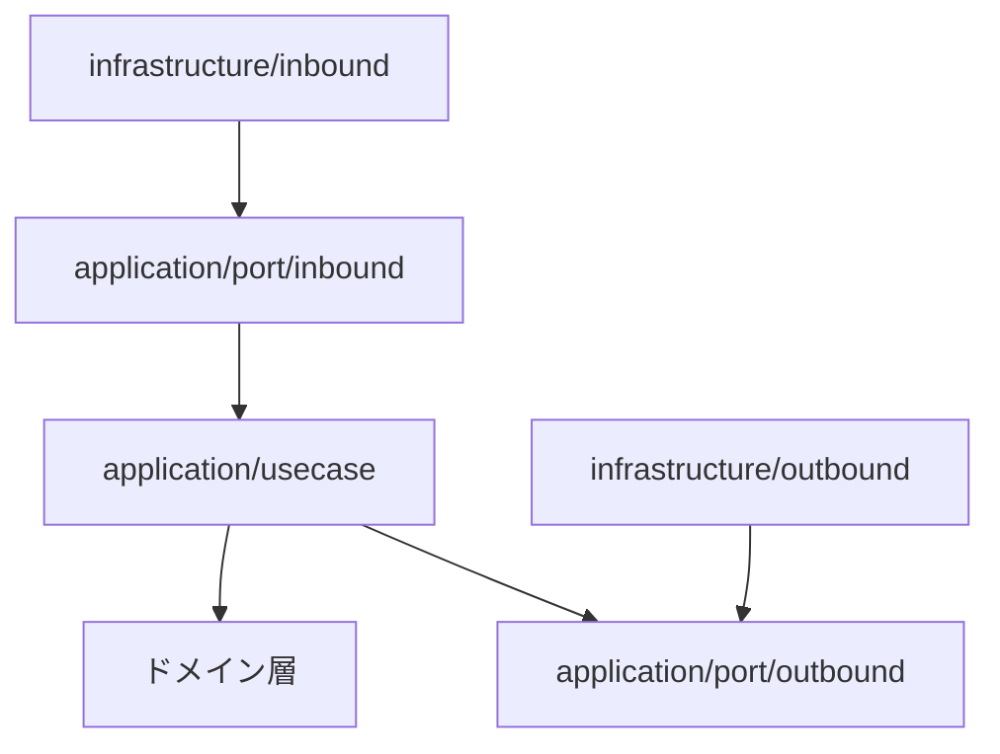

# アーキテクチャ概要

## システムアーキテクチャ
- 書籍管理という限定的な要件のため、モノリシックアーキテクチャを採用する
- ローカル環境 
  - アプリケーションと PostgreSQL は 個別コンテナとして実行する 
  - Docker Compose により複数コンテナ（アプリ・DB）の起動・依存関係を管理する

## ソフトウェアアーキテクチャ
- Clean Architecture を採用
    - `application/port/inbound`: ユースケースを呼び出す契約
    - `application/usecase`: ユースケース実装
    - `application/port/outbound`: 永続化・外部連携の契約
    - `domain`: エンティティと値オブジェクト
    - `infrastructure/inbound`: REST・SQS などの入力アダプタ
    - `infrastructure/outbound`: jOOQ などの出力アダプタ

### レイヤーごとの責務
- inbound: REST/SQS のリクエスト変換、入力検証、入力ポートの呼び出しに限定する。
- inbound port: inbound アダプタが利用するユースケースの契約を定義する。
- usecase: ワークフロー調整とアプリケーションサービスを担い、port を通じて外部要素を利用する。
- outbound port: ユースケースが必要とする永続化・検索の契約と参照モデルを定義する。
- domain: エンティティ、値オブジェクト、不変条件を保持する。フレームワークや永続化に依存しない。
- outbound: RDB などの外部リソースを実装し、outbound port を満たす。
- Spring の部品組み立てとトランザクション境界は `infrastructure/config` に置く。domain と usecase は Spring API に依存しない。

### 設計の進め方
- ドメインモデルは [`domain-modeling.drawio.svg`](./domain-modeling.drawio.svg) を基準とする
- ドメイン層は戦術的 DDD パターン（値オブジェクト / エンティティ）で実装する

## API 設計の前提
- REST 原則に従う（リソース指向、HTTP メソッドの意味付け）
- HATEOAS は必須ではない
- URI パターン・命名・レスポンス形式は既存 API と整合させる
